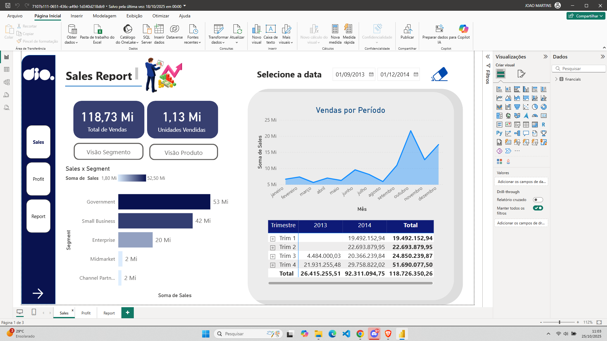
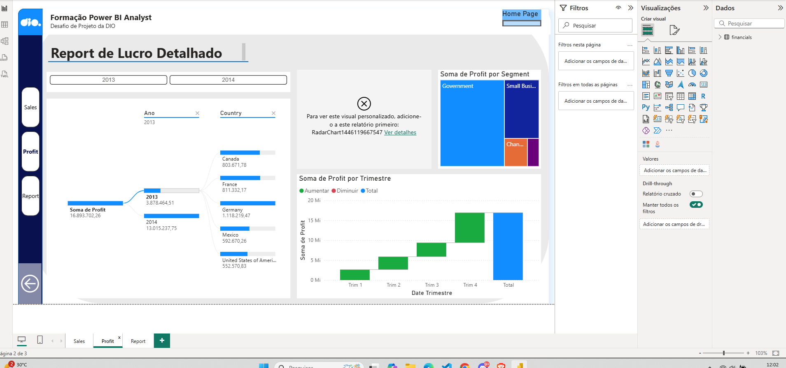
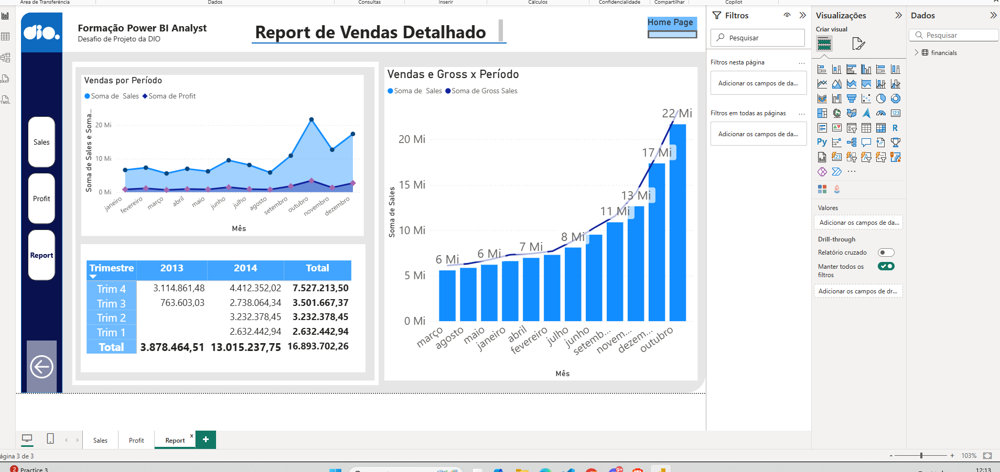

# Desafio DIO: Refatoração de Relatório Financeiro com Foco em UX/UI

Este projeto é a solução para o **"Desafio de Projeto - Atualizando Relatório Financeiro com Foco na Experiência do Usuário"**, proposto pela Digital Innovation One (DIO) no bootcamp de Power BI Analyst.

O objetivo foi refatorar um relatório financeiro "criativo", aplicando uma abordagem metódica de UI/UX para transformá-lo em um dashboard profissional, intuitivo e de alta performance.

## 🚀 Relatório Interativo (Power BI Service)

O relatório final está publicado e pode ser acessado interativamente no link abaixo:

**[Clique aqui para acessar o Relatório Interativo no Power BI Service](https://app.powerbi.com/groups/me/reports/50c4b010-ab72-42c3-94c0-25aae4d50f60/ReportSection?experience=power-bi)**

---

## 🎯 O Problema: O Desafio Original

O ponto de partida foi um relatório de página única que, embora visualmente criativo, apresentava desafios de Experiência do Usuário (UX):
* **Sobrecarga de Informação:** Muitos visuais e KPIs em um único local, dificultando a análise.
* **Navegação Confusa:** A falta de uma hierarquia clara tornava a jornada do usuário pouco intuitiva.
* **Falta de Feedback:** Elementos interativos não forneciam feedback claro ao usuário (como cliques ou *hover*).

O desafio da ementa era claro: aplicar princípios de design como **Posicionamento**, **Contraste**, **Proporção Áurea** e **Segmentação dos Dados** para resolver esses problemas.

## 💡 A Solução: Uma Abordagem Focada em UX

A estratégia foi redesenhar o relatório do zero, focando em uma arquitetura de informação que guia o usuário.

### 1. Arquitetura da Informação (Segmentação)

Em vez de uma única página, o relatório foi segmentado em três seções claras, cada uma com um propósito:
* **Página 1 - Sales (Visão Geral):** Funciona como a "Home Page", apresentando os KPIs mais importantes e uma visão macro do faturamento (Vendas Totais, Unidades).
* **Página 2 - Profit (Análise de Lucro):** Uma página de "mergulho" (drill-down) focada exclusivamente na lucratividade, analisando o lucro por segmento, país e trimestre.
* **Página 3 - Report (Análise de Vendas):** Uma página de "mergulho" focada nas vendas detalhadas, com análises de Vendas vs. Gross e desempenho temporal.

### 2. Design de Navegação Consistente

Para unificar a experiência, foi criado um **menu de navegação lateral persistente**:
* **Consistência:** O menu está presente em todas as 3 páginas, criando um "porto seguro" para o usuário, que sempre sabe onde está e para onde pode ir.
* **Hierarquia Visual:** O design do menu deixa claro qual página está ativa.

### 3. Interatividade e Feedback Visual (Microinterações)

Seguindo a diretriz do desafio de "destacar o focalizar e selecionar", todos os botões de navegação foram configurados com **3 estados visuais**:
1.  **Estado Padrão:** A aparência normal do botão.
2.  **Estado "Ao Focalizar" (Hover):** O botão muda sutilmente de cor quando o mouse passa por cima, sinalizando interatividade.
3.  **Estado "Ao Pressionar" (Press):** O botão muda para uma terceira cor no momento exato do clique, dando ao usuário um feedback tátil e imediato de que sua ação foi registrada.

### 4. Otimização de Visuais

Os gráficos foram escolhidos a dedo para contar a melhor história:
* **Substituição Inteligente:** O gráfico de área genérico foi substituído por visuais mais adequados, como Gráficos de Cascata (para entender a composição do lucro trimestral) e Gráficos de Coluna (para comparações diretas).
* **Matriz de Dados:** Uma matriz de vendas por trimestre foi criada para fornecer dados granulares de forma limpa e organizada.

## 🛠️ Tecnologias e Conceitos Aplicados

* **Software:** Power BI Desktop (Desenvolvimento) e Power BI Service (Publicação).
* **Conceitos de UX/UI:**
    * Arquitetura da Informação
    * Design de Interação (Microinterações)
    * Hierarquia Visual e Contraste
    * Segmentação de Dados
* **Recursos Específicos do Power BI:**
    * Navegação de Página
    * Ações de Botão (Navegar, Voltar)
    * Configuração de Estados de Botão (Padrão, Ao Focalizar, Ao Pressionar)
    * Agrupamento de Elementos Visuais
    * Gerenciamento de Temas e Cores

## 📸 Screenshots (Preview)

*Abaixo estão prévias estáticas. A experiência completa deve ser vista no [link interativo](https://SEU-LINK-DE-PUBLICACAO-DO-POWER-BI-AQUI).*

| Página Principal (Sales) | Report de Lucro (Detalhado) | Report de Vendas (Detalhado) |
| :---: | :---: | :---: |
|  |  |  |
